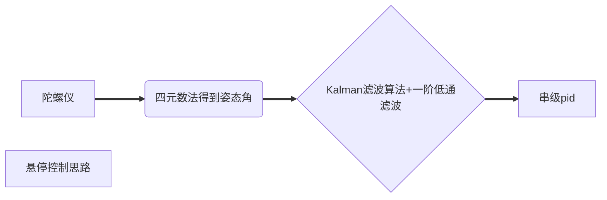
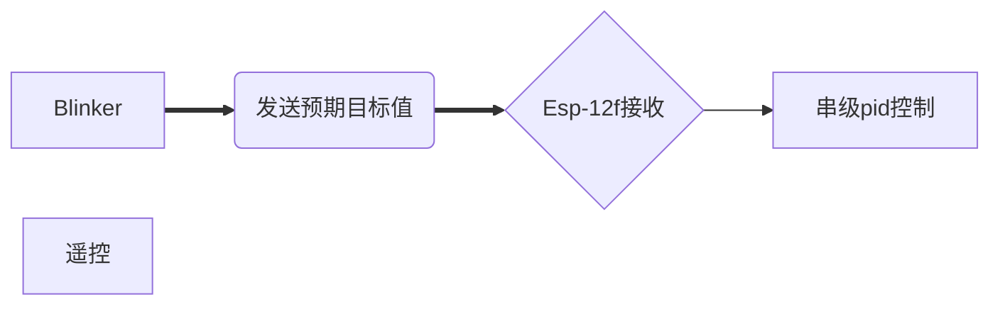

# Stm32_UAV

#### 介绍
####  使用Stm32f103c6t6开发板独立写的飞控程序。第一次入门，有错误的地方还望多多指正！

Stm32飞控

## 前言

从2023.7月开始，为学习飞控做准备。由于我们是第一次接触四轴飞行器（感觉挺有趣就把项目申报了），在实际写代码中确实发现比预期困难要大不少，同时对我们C语言水准进行考验。

### 硬件配置

#### 主板

1.stm32f103c6t6开发板（运算资源其实有点欠缺，当时选择是确实没想到）

#### 传感器

1.MPU6050六轴传感器（很基础的陀螺仪，很适合我们小白）

2.BMP280气压计

#### 通信

1.ESP-12f WIFI模块

#### 遥控

1.Android+Blinker

#### 电机及电调

K2212V*4+好盈20A *4


------------


## 项目介绍

### 控制思路：





### 项目资源(核心)

\```

——–User（重要的数据处理与控制）

—-Hareware（硬件驱动文件）

—–System（计算+数据）


\```

## 项目进度

- [x] imu计算四元角
- [x] 滤波
- [ ] 遥控器配置
- [ ] Pid调试
- [ ] 上机测试

